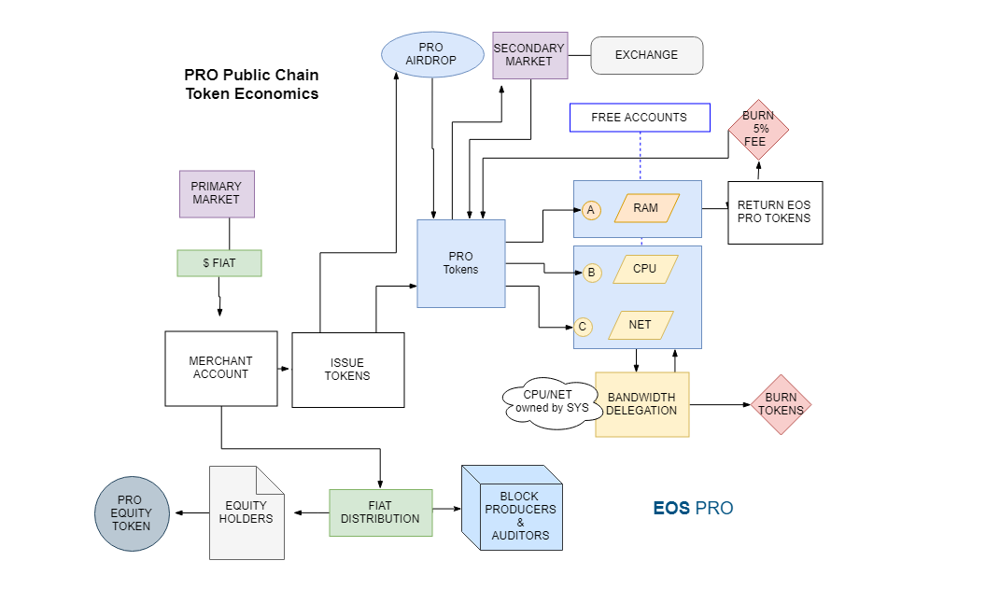
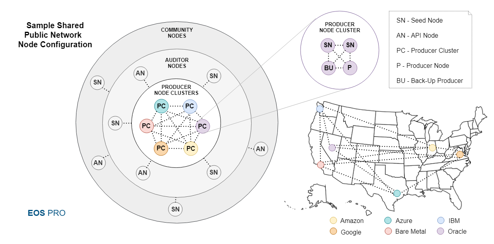
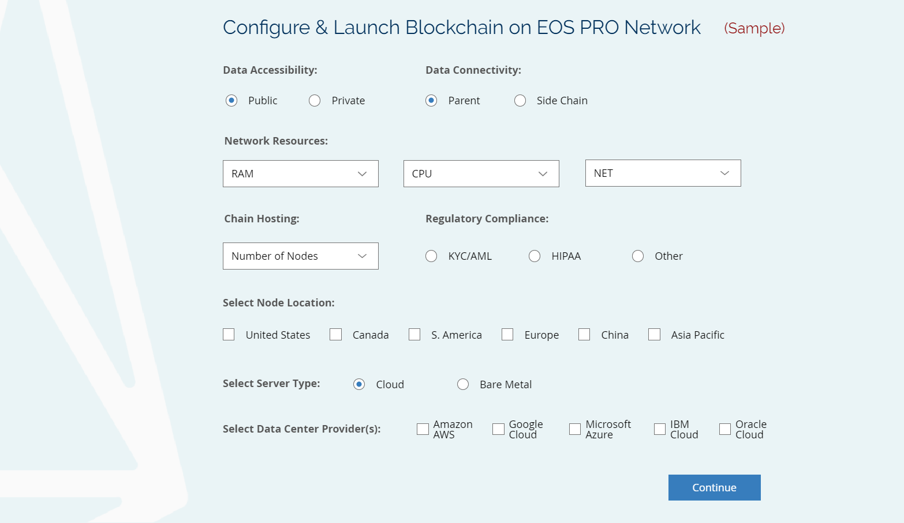
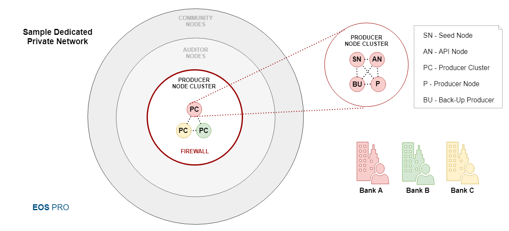

# EOS PRO Technical White Paper v1

**Abstract.** The protocol of the future is an interconnected network of blockchains, and EOSIO facilitates this vision by providing robust and powerful open-source blockchain software that enables inter-blockchain communication among other innovative features. EOS PRO introduces enterprise-grade distributed infrastructure that is designed to host nodes, operable by different groups, capable of supporting networks of many blockchains deployed using purposed configurations of the EOSIO software. It offers enterprises, entrepreneurs, developers and users a flexible, business-friendly environment for the deployment of blockchain applications, with affordable and fixed network resources that are easily available for purchase. The EOS PRO Network is comprised of flexible compliance-enabled block producer nodes hosted in vetted data centers strategically distributed by location and diversified by providers offering scalability, reliability, performance, security and compliance. The network hosts the EOS PRO Public Blockchain offering low-cost shared network resources, free user accounts, and cross-chain accessible accounts and tokens for a maximized network effect. For resource-intensive and private applications, EOS PRO offers custom configuration, deployment and hosting of purposed blockchains to provide dedicated resources. 

**DISCLAIMER:** ​THIS WHITE PAPER IS A WORK IN PROGRESS AND IS FOR INFORMATION PURPOSES ONLY AND SHOULD NOT BE CONSIDERED AS A GUARANTEE OF BUSINESS ACTIVITIES IN THE FUTURE. EOS PRO AND ITS AFFILIATES DOES NOT GUARANTEE THE CONCLUSIONS REACHED IN THIS WHITE PAPER OR THE ACCURACY THEREOF, AND DOES NOT MAKE ANY REPRESENTATIONS AND WARRANTIES, WHATSOEVER. EOS PRO AND ITS AFFILIATES SHALL HAVE NO LIABILITY FOR DAMAGES OF ANY KIND ARISING OUT OF THIS WHITE PAPER OR ANY OF THE CONTENT CONTAINED HEREIN.  EOS PRO RESERVES THE RIGHT TO CHANGE, MODIFY, ADD, OR REMOVE PORTIONS OF THIS WHITEPAPER AT ANY TIME, FOR ANY REASON. THIS WHITE PAPER DOES NOT CONSTITUTE AN OFFER OR SOLICITATION TO SELL TOKENS, SHARES, OR THE SERVICES OFFERED THERETO. EOS PRO IS AN INDEPENDENT ORGANIZATION NOT AFFILIATED WITH EOS.IO OR BLOCK.ONE.

<!-- @import "[TOC]" {cmd="toc" depthFrom=2 depthTo=6 orderedList=false} -->

<!-- code_chunk_output -->

* [Background](#background)
	* [About EOSIO Open Source Blockchain Software](#about-eosio-open-source-blockchain-software)
	* [The Team Behind the EOSIO Software](#the-team-behind-the-eosio-software)
* [Problems Faced by dApp Developers and Users](#problems-faced-by-dapp-developers-and-users)
	* [Network Resource Challenges](#network-resource-challenges)
	* [Perceived Network Risks](#perceived-network-risks)
	* [Lack of Network Flexibility and Support](#lack-of-network-flexibility-and-support)
* [Requirements for Enterprise Blockchain Applications](#requirements-for-enterprise-blockchain-applications)
	* [Easily Acquirable, Affordable and Fixed Network Resources](#easily-acquirable-affordable-and-fixed-network-resources)
	* [Business-Friendly Environment](#business-friendly-environment)
	* [Flexible and Supportive Network Infrastructure](#flexible-and-supportive-network-infrastructure)
* [The EOS PRO Network](#the-eos-pro-network)
	* [Enterprise-Grade Infrastructure](#enterprise-grade-infrastructure)
	* [Data Center Provider Diversification](#data-center-provider-diversification)
	* [Node Geographic Distribution](#node-geographic-distribution)
	* [Flexible Multi-Node, Multi-Chain Hosting Capability](#flexible-multi-node-multi-chain-hosting-capability)
	* [Support for Inter-Blockchain Communication](#support-for-inter-blockchain-communication)
	* [Data Validation and Block Production](#data-validation-and-block-production)
	* [External Auditor Nodes](#external-auditor-nodes)
	* [Block Producer and Auditor Node Rewards](#block-producer-and-auditor-node-rewards)
	* [Data Preservation](#data-preservation)
	* [Regulatory Compliance-Ready Nodes](#regulatory-compliance-ready-nodes)
	* [Protection of Intellectual Property](#protection-of-intellectual-property)
* [The EOS PRO Public Blockchain](#the-eos-pro-public-blockchain)
	* [PRO Token: Affordable and Fixed Shared Network Resources](#pro-token-affordable-and-fixed-shared-network-resources)
	* [Block Production and Data Auditing](#block-production-and-data-auditing)
	* [Free Accounts](#free-accounts)
	* [Network Effect with Sharable Accounts and Tokens](#network-effect-with-sharable-accounts-and-tokens)
	* [Low Cost Token Issuance and Distribution "Air Drops"](#low-cost-token-issuance-and-distribution-air-drops)
	* [Utility Token Airdrop](#utility-token-airdrop)
	* [Network Governance](#network-governance)
* [Customizable Dedicated Blockchains](#customizable-dedicated-blockchains)
	* [Dedicated Network Resources](#dedicated-network-resources)
	* [Custom System Configurations](#custom-system-configurations)
	* [Data Accessibility](#data-accessibility)
	* [Data Interconnectivity](#data-interconnectivity)
	* [Block Producer Node Configuration and Management](#block-producer-node-configuration-and-management)
	* [System Contracts](#system-contracts)
	* [Governance](#governance)
* [Hands-On Service and Support](#hands-on-service-and-support)
	* [EOSIO Software Customization, Configuration and Orchestration](#eosio-software-customization-configuration-and-orchestration)
	* [Node Setup and Management](#node-setup-and-management)
	* [Full Stack Blockchain Application Development and Architecture](#full-stack-blockchain-application-development-and-architecture)
	* [Network Support](#network-support)
* [Conclusion](#conclusion)
	* [References](#references)

<!-- /code_chunk_output -->

## Background 

#### About EOSIO Open Source Blockchain Software

Block.one announced EOSIO open-source blockchain software in 2017 with an operating system-like construct designed to enable vertical and horizontal scaling of decentralized applications. The EOSIO software provides next-generation solutions to many of the problems preventing wide-scale adoption of distributed ledger technology, such as usability, scalability, consensus and governance. It offers robust cutting-edge features detailed in the EOSIO documentation[1](#references), which include:

 - Potentially unlimited throughput in terms of transactions per second.[2](#references)
 - Ability to eliminate user fees.
 - High throughput, configurable Delegated Proof of Stake (DPOS) permissioned consensus algorithm. 
 - User-friendly accounts.
 - Dynamic account permissions.
 - On-chain database.
 - Powerful smart contracts in C++, compiled to Web-Assembly.
 - User account token issuance.
 - Worker proposal system.
 - Configurable distributed governance and constitution.
 - Human-readable Ricardian Contracts compatible with dispute resolution. 
 - Parallel transaction execution for distributed workload.
 - Inter-blockchain communication through light clients within smart contracts.
 - Easy upgrades and bug recovery

The EOS.IO software enables inter-blockchain communication "IBC" that uses light client validation to produce relatively lightweight proof of existence that can be validated by anyone tracking a blockchain to prove that a particular transaction was included in a particular block within the verified history of a particular blockchain. IBC facilitates load distribution within multiple synchronized side-chains for scalability, as well as intercommunication between independent blockchains for data transfer.

For a detailed introduction to EOSIO software and comparisons with competing technology, see *EOSIO - An Introduction by Ian Grigg*[3](#references) 

#### The Team Behind the EOSIO Software

The Block.one team, developers of the EOSIO open-source software, hold the record for the largest ICO to date, having raised over $4 billion[4](#references).  Development is led by experienced blockchain architect Dan Larimer who brings experience, proven concepts and best practices to EOSIO, and who built the three most active blockchains in terms of number of transactions[5](#references). EOSIO has quickly become the most widely used blockchain, followed by Dan's other two projects BitShares and Steem. Dan and his team continue to develop the software[6](#references) over a ten year period of vested interest in tokens. 

One billion dollars in venture capital has been deployed[7](#references) for applications built using EOSIO software, which is backed by industry influencers such as billionaire PayPal co-founder Peter Thiel and crypto mining hardware billionaire Jihan Wu of Bitmain[8](#references), among others.

## Problems Faced by dApp Developers and Users

While the EOSIO software can be leveraged for the development of powerful and robust blockchain applications, the following challenges exist when it comes to deployment on existing networks:

#### Network Resource Challenges

  - **Volatility and unpredictability:** Network resource costs are often market based and lead to volatility from speculation, which results in unpredictability and the inability to budget and project costs.

  - **High cost:** Buying network resources such as RAM for application deployment can be relatively expensive and potentially require tens or hundreds of thousands of dollars in token acquisition costs for powering user interactions with applications and business strategies such as token distribution "airdrops." 
  
  - **Purchase difficulty:** dApp developers and users wanting to purchase network resources using fiat face technical and legal difficulties registering to exchanges, scanning documents, exchanging cryptocurrency, managing private keys and wallets, making token transfers, and surmounting other obstacles that create user friction. 

#### Perceived Network Risks

Public networks maintained by diverse community groups around the world might expose application developers and users to perceived risks related to performance, security, governance, system configurations, and an inability to comply with regulation. 

#### Lack of Network Flexibility and Support

Applications deploying on existing networks are subject to network pre-configurations involving network resources, governance, jurisdiction, and other issues that are potentially incompatible with application requirements. This means application developers have to adapt to limited options.

Application developers who want to launch their own blockchains to meet resource, scaling, and configuration requirements are faced with a steep learning curve and the costs and challenges associated with configuring system settings, managing infrastructure and orchestrating incentive models to pay data validators.

## Requirements for Enterprise Blockchain Applications

To meet the needs of direct users of blockchains—the enterprises, entrepreneurs and developers who author and deploy smart contracts for distributed applications—network infrastructure needs to offer the following: 

#### Easily Acquirable, Affordable and Fixed Network Resources

Users and developers benefit from predictable and affordable network resource costs because of the ability to project and budget application consumption costs. To facilitate an optimal user and developer experience, network resources need to be affordable, fixed, priced in dollars and easily available for purchase in fiat and cryptocurrency.

#### Business-Friendly Environment

Block producing nodes need to be hosted in trusted infrastructure that has been tried, tested and proven to meet demanding expectations in performance, scalability and security.  

Applications require the ability to comply with regulations and an environment conducive to business with compatible and predictable governance. 

#### Flexible and Supportive Network Infrastructure 

Requirements within individual blockchain applications might vary widely depending on use case. To meet the specific needs of applications, the infrastructure must be flexible in terms of deployment options and system configurations which include governance, legal jurisdiction, network resource allocation, and node distribution.

Lightweight applications require the option of deployment within compatible blockchains offering shared resources. Resource-intensive and demanding applications require the option of launching purposed, "dedicated" blockchains allowing for customizable system configurations to fit specific needs.

Networks need to support inter-blockchain communication to allow connectivity among shared and dedicated blockchains to share information and accounts, and to transfer value to provide the benefit of the network effect. 

## The EOS PRO Network

#### Enterprise-Grade Infrastructure

The EOS PRO infrastructure is maintained in trusted and highly vetted enterprise-grade data centers capable of meeting the following requirements:

- **High performance:** An environment able to provide exceptional performance and uptime, with around-the-clock availability for support.

 - **Scalability:** The necessary infrastructure, resources, skill set and preparation to quickly scale up resources at a moment's notice and keep up with demand. 

 - **Security:** Data center and network architecture built to meet the requirements of the most security-sensitive organizations.

#### Data Center Provider Diversification

PRO offers data center infrastructure from a growing range of providers for diversification, which includes cloud-based and bare metal infrastructure from leading providers such as Amazon AWS, Microsoft Azure, Google Cloud and IBM. 

#### Node Geographic Distribution 

PRO supports node hosting in dozens of zones and geographic regions which can be strategically connected to minimize network latency. 

#### Flexible Multi-Node, Multi-Chain Hosting Capability 

The EOS PRO infrastructure is flexible enough to host multiple nodes to support many blockchains comprising testnets and public and private chains while offering shared and dedicated network resources. The network supports user configured producing and non-producing nodes that can be connected to existing networks for dedicated end points and data validation, or used for the deployment of new blockchain networks.

#### Support for Inter-Blockchain Communication

The network supports inter-blockchain communication for almost unlimited scaling potential and a valuable network effect resulting from data synchronization and the sharing and transferring of accounts, assets, and other data. 

Side-chains can be used to divide the transaction workload between multiple blockchains operated in parallel to theoretically scale to millions of transactions per second.[2](#references) Each chain can have over one terabyte of RAM, and decentralized applications can send messages between chains with just a couple of seconds of latency.

This flexible infrastructure is designed to support the protocol of the future, an inter-connected network of scalable blockchains operated by different groups in alignment with the vision of EOSIO software developer Dan Larimer:

*"My belief is that true decentralization is the free market. It's the ability to have lots of different blockchains competing with each other. Only the market is open entry, anyone can enter into it. It's very difficult to censor because someone can just start a new chain. So having many blockchains, each operated by different groups, all competing to earn the trust of the users. It's the competition to earn trust, that will drive value, and it's competition that keeps people honest; and that's the ultimate decentralization. Having one blockchain rule them all is centralized in its own right."*

  -*Dan Larimer, Blockchain Live Conference September 2018*[9](#references)

#### Data Validation and Block Production

PRO infrastructure offers flexibility in terms of network architecture, configuration and node management. Nodes can be operated by the PRO team, by application developers, or by delegated entities voted in by a community. Through this flexibility, a blockchain can be fully hosted within the PRO infrastructure, or in combination with nodes outside of the PRO infrastructure. 

**Producer Node Clusters** is a collection of nodes that operate behind a proxy/load balancer to distribute load and provide security against DDoS and other malicious attacks. 

**Producer Nodes** have the primary role of producing blocks and synchronizing among other producer nodes within the P2P mesh network secured by firewalls.

**Backup Producer Nodes** offer redundancy and are ready take over should an active server have problems. While non-producing, they can help producers with load balancing and transaction validation to reduce workload. 

**Seed Nodes** communicate with other non-producing nodes in order to maintain synchronization with the producer nodes and provide a layer of insulation between producers and other nodes.

**API Nodes** help handle requests submitted to the network to effectively reduce the workload of producer nodes by "pre-processing" transactions, rejecting invalid requests and relaying valid transactions to other nodes.

#### External Auditor Nodes

To add additional layers of trust, Auditor Nodes can be added to blockchains operated within the PRO Network. These auditor nodes are operated independently by outside trusted entities running non-producing full nodes which maintain synchronization with producer nodes to verify the validity of transactions, replicate and validate application state, and verify that no transactions have been skipped or omitted. The EOSIO software facilitates this by assigning a sequence number to every Action, which an auditor can use to prove that all Actions intended for a particular account have been processed and that they were processed in order, known as Proof-of-Completeness.[10](#references)

In addition to validation services, Auditor Nodes can:

 - Service other nodes.
 - Provide access to other blockchains via inter-blockchain communication.
 - Provide a layer of insulation between producers and other nodes.
 - Help handle requests from cleos to perform transactions and query state.
 - Pre-processing of transactions to help filter faulty transactions going to producer nodes.
 
#### Block Producer and Auditor Node Rewards

Nodes operated on the PRO Network as well as Auditor Nodes providing validation services are funded in fiat from a percentage of proceeds generated by network resource sales. This allows the network to offer users and developers of decentralized applications a frictionless method of purchasing shared or dedicated network resources using fiat.

#### Data Preservation

Blockchains operated within the PRO infrastructure prevent data loss by preserving blockchain history for a period of five years after a blockchain is terminated by a user or by PRO for nonpayment. This prevents loss of data and anyone with access to blockchain history to access and reinstate the chain within the PRO network or under a different environment. 

#### Regulatory Compliance-Ready Nodes

Nodes within the PRO network enable compliance by supporting configurations related to KYC, AML, HIPAA and other regulations that require strict control over data collection, privacy, hosting jurisdiction, and other procedures. 

When compliance requirements are beyond what can be provided by a public network, developers have the ability to easily and cost-effectively configure and launch a purposed blockchain that can be configured to meet the most demanding regulatory requirements.

#### Protection of Intellectual Property 

Application developers deploying smart contracts on EOS PRO can reserve rights to intellectual property for smart contracts deployed on the network, with no forced requirement for the free and open source licensing of source code by the protocol terms of use.

## The EOS PRO Public Blockchain

EOS PRO hosts a public blockchain offering shared network resources at an affordable, fixed price. The goal of the PRO Public Network is to offer users and blockchain applications that do not require dedicated resources, a business-friendly network for deployment, which can facilitate inter-blockchain communication from side-chains and outside blockchains for a network effect. 

#### PRO Token: Affordable and Fixed Shared Network Resources 

The PRO Public Blockchain eliminates the speculative market from network resources and offers a "PRO Token" at a fixed price in USD that represents a fixed unit of utility for shared network resources. Tokens are available for purchase directly from EOS PRO in both fiat and supported cryptocurrencies through a continuously open network utility token sale that issues tokens upon purchase. 

Users and applications deployed on the EOS PRO Public Blockchain consume three broad classes of resources: 

 - Bandwidth (NET)
 - Computation and Computational Backlog (CPU) 
 - State Storage (RAM)

**Rentable NET and CPU**

CPU and NET resources are owned by the EOS PRO network and are rented to users. Each token can be used to rent a fixed amount of CPU and NET time per month. Tokens are burned upon receipt of the rental contract payment. This results in affordable resources without having to buy and hold a large number of tokens.

**Staking for RAM**

Each PRO token can be staked to provide a specified account a fixed amount of RAM. Users can free up RAM usage and unstake to withdraw tokens. Unstaked tokens will be returned to the account minus a 5 percent RAM unstaking fee. Unstaked tokens can be transferred freely to other accounts.

#### Block Production and Data Auditing

Block producer nodes for the PRO Public Chain will be hosted on the EOS PRO infrastructure and maintained by the EOS PRO core team along with independent auditors, to ensure the integrity and validity of blockchain data. Outside auditor nodes will be paid in fiat using a portion of token sales for data auditing services. Users can run full nodes and replay the ledger to independently verify the blockchain data. The public network will be initially available within the United States, followed by expansion to other countries. Then it will expand to offer geographic and jurisdictional flexibility.

 
 
 
 #### Network Scalability

Nodes supporting the PRO Public Blockchain are prepared to scale proportionate to the tokens issued to provide the necessary network resources to meet demand. A single chain can scale to provide over one terabyte of RAM, and additional side-chains can be launched to add additional capacity to the network. 

#### Free Accounts
	
Unique users can create free accounts on the Pro Public Blockchain for low friction access to blockchain applications running on the network as well as deployment of smart contracts. A system-level smart contract allocates enough resources to new accounts for basic interaction, with an easy option to purchase more resources.  

#### Network Effect with Sharable Accounts and Tokens

The PRO Public Blockchain can be used as a central place for the creation of free accounts and the low cost issuance and distribution of tokens, which can be shared among various applications and outside blockchains using inter-blockchain communication, to create a network effect. For example, an account created by one application can access any application without having to create another account. Applications looking to distribute tokens via air drops can offer distribution to all accounts on the PRO network and on inter-connected chains. 

#### Low Cost Token Issuance and Distribution "Air Drops"  

PRO will take a snapshot of existing EOS Main Net accounts and issue accounts accessible on the PRO Public Blockchain. Applications can issue and distribute tokens by "air drop" to these accounts at a fixed, affordable price. 
 
#### Utility Token Airdrop

The PRO Public Blockchain will issue and transfer a fixed number of PRO tokens to all EOS Main Net accounts issued on the public chain as an "air drop" aiming to serve as a free trial of network resource tokens that can be used to access a guaranteed amount of CPU and bandwidth for a fixed period of time, as well as a fixed amount of RAM database storage.  

#### Network Governance

To enable compliance and provide a business-friendly environment, the PRO Public Blockchain will be governed by EOS PRO in the best interest of application developers and users and in adherence of applicable state and federal laws. Disputes on the network may be influenced by the terms of use and policy of specific applications, protocol terms of use, and applicable legal jurisdictions. 

## Customizable Dedicated Blockchains

The PRO infrastructure allows for the configuration and deployment of producer nodes to support the purposed blockchains and eliminate the need for developers to manage their own infrastructure or design token economics for paying block producers in token inflation. 

#### Dedicated Network Resources

Each dedicated blockchain network can have over one terabyte of RAM and dedicated CPU and network bandwidth resources. This allows resource intensive applications to scale without incurring excessive shared resource costs. Additional chains can be launched to balance transactions across parallel chains to potentially scale to an unlimited number of transactions. 

#### Custom System Configurations  

Dedicated blockchains offer high flexibility for meeting specific application requirements through robust features and purposed configurations.

#### Data Accessibility

When launching a dedicated blockchain using EOSIO software, data accessibility can be made public or private. A party launching a chain can configure permissions and rules of participation within the party's network. Blockchains that want to make data private can set permissioned end points that prevent unauthorized access.

 

#### Data Interconnectivity

Blockchains can enable inter-blockchain communication by sending messages among outside chains or side-chains with just a couple of seconds of latency.[11](#references) Multiple chains can use the same token and accounts as the basis for staking and resource allocation, creating the maximum possible network effect around a single token. 

#### Block Producer Node Configuration and Management

The quantity of nodes, their location and data center provider can be configured by users. Blockchains can be supported solely by nodes operating within the PRO network or in combination with nodes operating outside of the network. Nodes can be managed by EOS PRO, by outside entities, or by nodes elected according to configured governance. Outside auditors can be used as an additional layer of data validation and API services.

#### System Contracts

There are several minimal contracts involved in operating an EOSIO blockchain which can be configured to set the following:

 - Basic operating behavior
 - Account and global operating limits
 - Account privileges and authorization levels
 - Block producers
 - System tokens
 - Token staking
 - Network resources 
 - Voting on producers and worker proposals 
 - Blockchain economics 

#### Governance

Networks can set a governing constitution to bind together their community and establish rights, liabilities and obligations as a basic standard to be enforced in dispute resolution. 

## Hands-On Service and Support

EOS PRO offers hands-on service, tools and support for application developers and users operating on the network. These services include the following:

#### EOSIO Software Customization, Configuration and Orchestration 

Support is provided for simple or extensive purposed customizations and configurations to the EOSIO software, including network and security architecture, and orchestration.

#### Node Setup and Management

Customized node setup including custom bare metal server builds and launching of cloud-based instances. Management includes node cluster architecture and orchestration and assisted or managed operation of nodes.  

#### Full Stack Blockchain Application Development and Architecture

Full stack development is offered, from smart contracts to local front and back-end environments that support blockchain applications.

Application data architecture services related to the development of smart contracts which may include considerations such as designating a "source of truth," network resource utilization, including an on-chain database, optimization, and local environment synchronization and replication.  

#### Network Support

PRO offers application developers and users a single point of contact to help navigate the PRO Public Network and manage PRO Tokens.

## Conclusion

EOSIO provides powerful and robust blockchain software built from experience, proven concepts and best practices, enabling a vision of a globally scalable network of inter-connected blockchains operated by individual groups. EOS PRO offers flexible enterprise-grade infrastructure, tools and services helping support this vision.

#### References

- [1] https://github.com/EOSIO/Documentation/blob/master/TechnicalWhitePaper.md
- [2] https://medium.com/eosio/eosio-dawn-3-0-now-available-49a3b99242d7
- [3] https://eos.io/introduction
- [4] https://coinmarketcap.com/ 
- [5] https://blocktivity.info/
- [6] https://github.com/eosio/eos/graphs/commit-activity  
- [7] https://www.econotimes.com/Blockchain-startup-Blockone-announces-1B-venture-fund-EOS-VC-1330074 
- [8] https://block.one/news/block-one-closes-strategic-investment-round-led-by-peter-thiel-and-bitmain/
- [9] https://youtu.be/bySDnzUJWR8?t=1199
- [10]https://github.com/EOSIO/Documentation/blob/master/TechnicalWhitePaper.md#proof-of-completeness 
- [11] https://medium.com/eosio/introducing-eosio-dawn-4-0-f738c552879